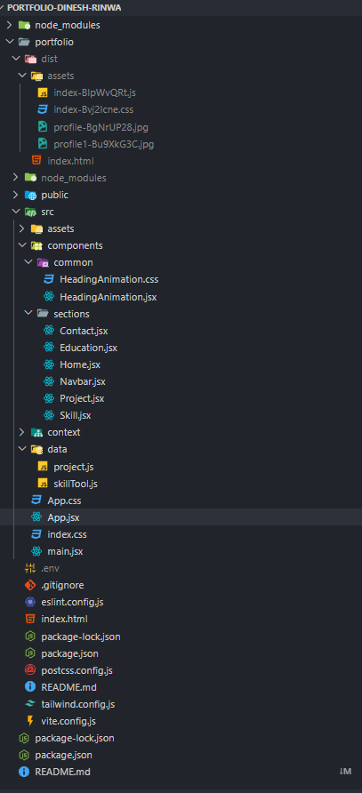

# 🚀 Portfolio - Dinesh Rinwa  

A modern, responsive **portfolio website** built with **React, Tailwind CSS, and Framer Motion**. It showcases my **skills, projects, and experience** as a **Full Stack Web Developer**.  

🔗 **[Live Demo]()**  
🔗 **[LinkedIn Profile]()**  

## 🚀 Modern Responsive Portfolio Website  

A fully **responsive** portfolio website built using **React, Tailwind CSS, and Framer Motion**. This project highlights my **skills, projects, and experience** while providing a clean and interactive user experience.  

## 📖 Table of Contents  
- 🔍 [Overview](#overview)  
- ✨ [Features](#features)  
- 🛠 [Technologies Used](#technologies-used)  
- 📂 [Project Structure](#project-structure)  
- ⚙️ [Installation & Setup](#installation--setup)  
- 🚀 [Usage](#usage)  
- 🖼 [Screenshots](#screenshots)  
- 🤝 [Contributing](#contributing)  
- 📞 [Contact](#contact)  

## 🔍 Overview  
This portfolio website is designed to make a **strong impression** through its **modern design and smooth animations**. It includes multiple sections:  

### **📌 Navbar:**  
- **Mobile:** A **modern, icon-based bottom navbar** for a minimal look.  
- **Tablet & Desktop:** A **top navbar** featuring full text options: **Home, Projects, Skills, Education, and Contact.**  

### **🏠 Home Section:**  
#### **Left Div:**  
- **Animated heading:** "Hire as a Frontend Developer | Full Stack Developer".  
- A **short professional summary** in a paragraph.  
- **Three action buttons** with icons for **LinkedIn, GitHub, and Resume.**  

#### **Right Div:**  
- A prominent, **fully rounded profile image.**  

### **📂 Projects Section:**  
- **Heading:** "Future Ready Projects with AI".  
- A **responsive grid of project cards.** Each card includes:  
  - **Project image.**  
  - **Project title and brief description.**  
  - **List of technologies used.**  
  - **Two buttons:**  
    - **GitHub Repository** link.  
    - **Live Demo** link.  

### **🛠 Skills & Tools Section:**  
- Display of **various skills and tools** with images inside **bordered, rounded containers** – optimized for responsiveness across all devices.  

### **🎓 Experience & Education Section:**  
- A clean layout featuring **headings** and **descriptive paragraphs** about **professional experience and educational background.**  

### **📞 Contact Section:**  
- Contains **contact information** and/or a **functional contact form** for quick communication.  

## 💻 Technologies Used  
- **React.js** – For building a **dynamic and component-based UI.**  
- **Tailwind CSS** – For **fast and responsive styling.**  
- **Framer Motion** – For **smooth animations and interactive UI elements.**  


---

## 🗂 Project Structure

Here's a high-level overview of the project structure:




---

## 🔧 Installation & Setup

1. **Clone the Repository:**

   ```bash
   git clone https://github.com/yourusername/portfolio-app.git
   cd portfolio-app


## 📸 Screenshots


