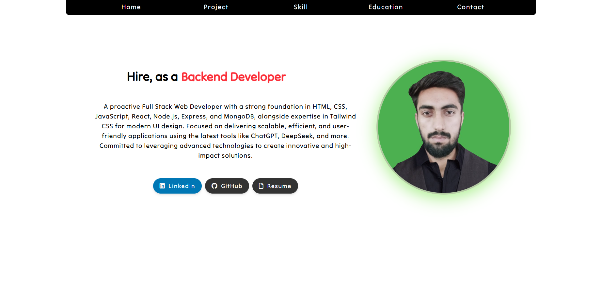
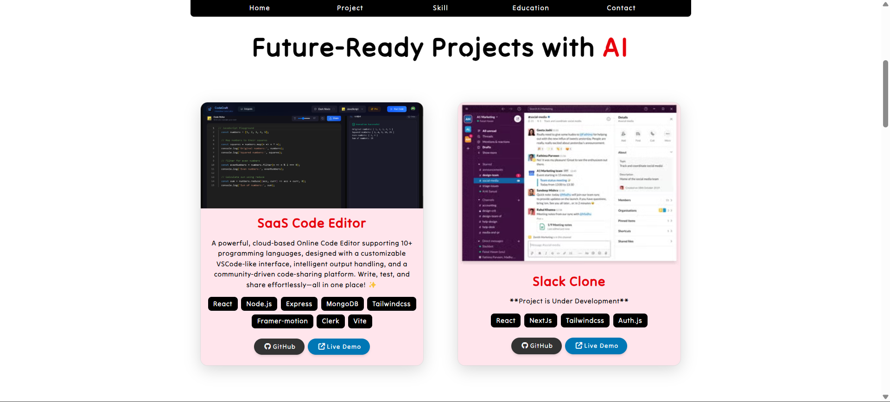
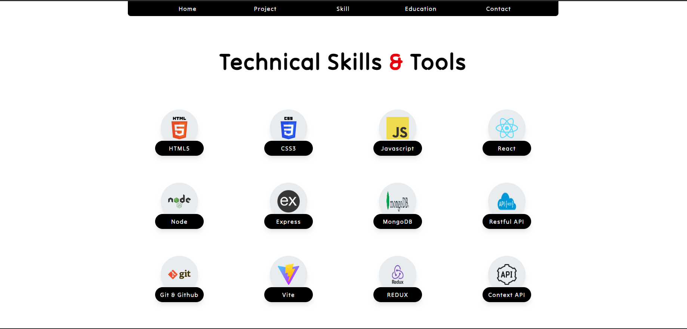
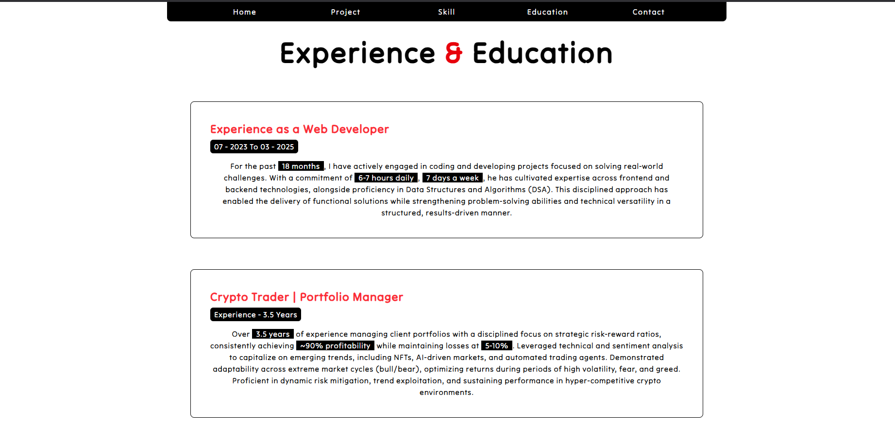
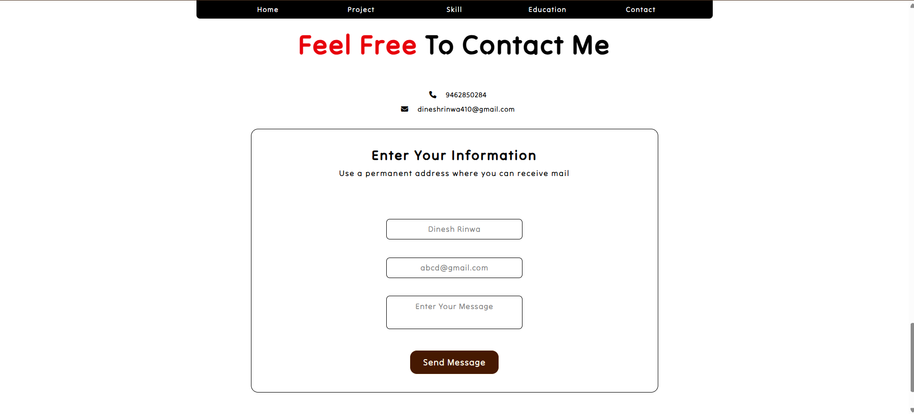

# portfolio-dinesh-rinwa
A modern, responsive portfolio website built with React, Tailwind CSS, and Framer Motion. It showcases my skills, projects, and experience as a Full Stack Web Developer. Features include a dynamic homepage, project gallery, skills section, and contact form, offering a clean and interactive user experience.

## 📸 Screenshots

